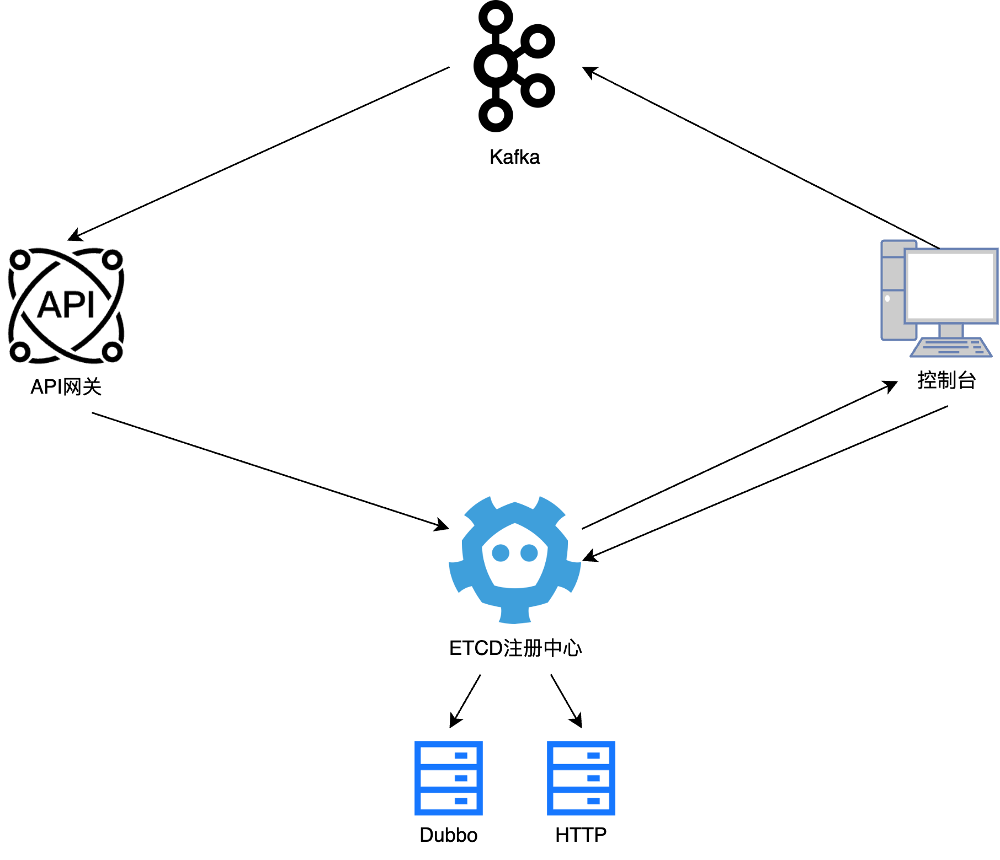

# ray-gateway
在生产环境中，API网关部署的拓扑结构如下图所示。下游服务启动时向注册中心添加自身服务的元数据信息，API网关启动时与注册中心连接，拉取所属命名空间及环境的下游服务的元数据信息，从而完成一系列外部请求的处理与响应，并且在处理请求过程中，将监控数据上报到Kafka中，控制台直接与注册中心交互，完成对各类元数据信息的管理与维护，并且通过拉取Kafka中的数据实现对API网关整体的监控。



本系统的开发语言为Java，核心开发框架使用Netty。注册中心采用ETCD，消息队列使用的是Kafka，最后基于Docker进行部署。各种软件的版本如下表所示。

| 软件      | 版本号       |
| --------- | ------------ |
| JDK       | 1.8          |
| Netty     | 4.1.51.Final |
| ETCD      | 3.3.27       |
| Kafka     | 3.3.1        |
| Dubbo     | 2.7.4.1      |
| Zookeeper | 3.8          |
| Docker    | 24.0.7       |

## 环境搭建
### [docker搭建zookeeper集群](https://www.sherry.zone/posts/65774202.html)

### [docker搭建etcd集群](https://www.sherry.zone/posts/e1b193a2.html)

### [docker搭建kafka](https://www.sherry.zone/posts/e59f4313.html)

## 系统配置

### 网关核心模块配置

- 将 `core/src/main/resources/gateway.properties` 配置文件中注册中心地址 `registryAddress` 更改为当前部署的ETCD地址

```Properties
registryAddress=http://#:20000,http://#:20002,http://#:20004
namespace=ray-gateway
env=dev
```

- 将 `core/src/main/java/cn/ray/gateway/core/GatewayConfig.java` 网关配置类中的 `kafkaAddress` 更改为当前部署的Kafka地址

### 网关下游服务配置

- 将 `test-mvc/src/main/resources/application.yml` 或 `test-mvc/src/main/resources/gateway.properties` 配置文件中注册中心地址 `ray-gateway.registryAddress` 更改为当前部署的ETCD地址

```yaml
server:
  servlet:
    context-path: /
  port: 8084

ray-gateway:
  registryAddress: http://#:20000,http://#:20002,http://#:20004
  namespace: ray-gateway
  env: dev
  tags: 1
```

### 网关控制台配置

- 将 `console/src/main/resources/application.properties` 配置文件中注册中心地址 `gateway.console.registryAddress` 更改为当前部署的ETCD地址，以及 `gateway.console.kafkaAddress` 更改为当前部署的Kafka地址

```Properties
server.port=9005

gateway.console.registryAddress=http://#:20000,http://#:20002,http://#:20004
gateway.console.namespace=ray-gateway
gateway.console.env=dev

gateway.console.kafkaAddress=#:9192
gateway.console.consumerNum=1
gateway.console.groupId=gateway-consumer
gateway.console.topicNamePrefix=gateway-metric-topic
```

## 系统运行

### 启动网关

运行 `core/src/main/java/cn/ray/gateway/core/Bootstrap.java` 网关核心模块中的启动类

### 启动下游服务

运行 `test-mvc/src/main/java/cn/ray/test/mvc/Application.java` 网关下游服务启动类

如需启动多个服务，可勾选应用配置 `Operation System` 中 `Allow multiple instances` 允许多个实例


启动一个服务实例后，之后更改其配置文件中的端口配置即可启动对应端口的服务实例

### 启动控制台

运行 `console/src/main/java/cn/ray/gateway/console/Application.java` 网关控制台模块启动类